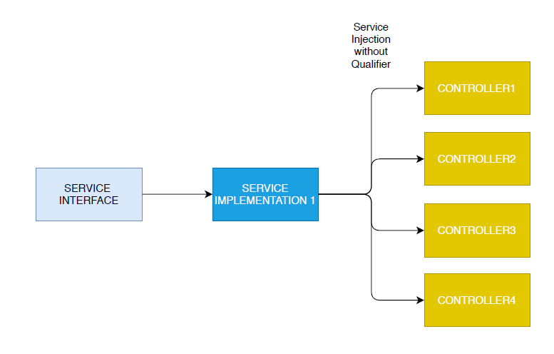
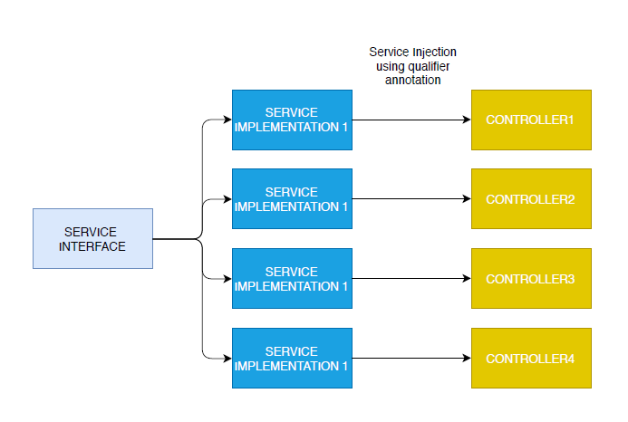
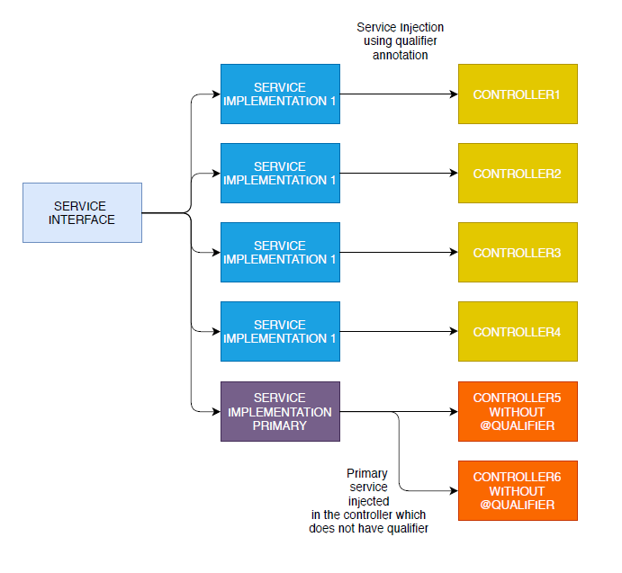
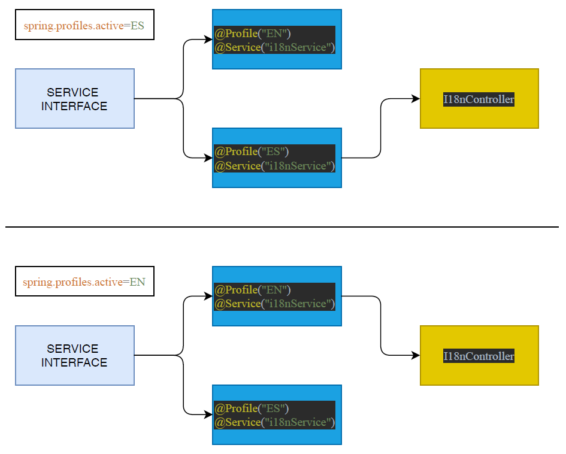
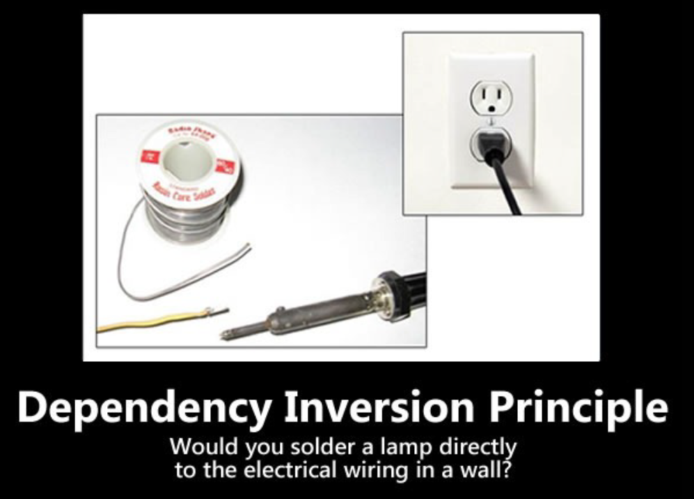

# Dependency Injection

## SOLID Principle

1. **S**ingle Responsibility Principle
   1. Just because you can does not mean you should
   2. Every class should have one responsibility
   3. There should not be more than one reason for class to change
   4. Avoid "GOD" Class
   5. Split bigger classes into smaller classes
   6. Results into good test coverage
2. **O**pen / Close Principle
   1. Class should be open for extension but close for modification
   2. Use abstract base class
3. **L**iskov Substitution Principle
   1. If it looks like a duck, quack like a duck, but need battery, then you probably have wrong abstraction
   2. Object in program would be replaceable with instances of their subtype without altering the correctness of the program
4. **I**nterface Segregation Principle
   1. Make fine grain interface that are client specific
   2. Many client specific interfaces are better then one general purpose interface
5. **D**ependency Inversion Principle
   1. Avoid circular dependency
   2. Abstraction should not depends upon detail 
   3. But detail should depends upon abstraction
6. Focusing on Dependency management

## Spring Container

1. Spring container can be understand as a space created by spring framework

2. This space is being utilized by spring to store different objects 

3. This objects are known as **beans**

4. When spring project starts up, it **scans all the spring components** which are present in that particular project

5. After scanning all the components, it creates object(beans) of all the components

6. This created beans are stored in spring container

7. So whenever we ask for some object(bean) in our class for usage, spring provides us the exact bean which is already created by it and stored in spring container

8. Create a spring component name ```computer```

   ~~~java
   @Component
   public class Computer {
   
       // properties
       private String screen;
       private String ram;
       private String processor;
   
       // constructor
       public Computer() {
           System.out.println("computer object generated");
       }
   
       // method associated to this class
       public String computerMethod(){
           System.out.println("computer Method executed");
           return "computerMethod";
       }
   }
   ~~~

9. Now as soon as spring application starts up, it will create the instance of the computer class and keep this instance in the container, so whenever if some class need this instance it will provide it

10. Accessing the bean in application class

    ~~~java
    @SpringBootApplication
    public class DependencyInjectionApplication {
        ApplicationContext context = SpringApplication.run(DependencyInjectionApplication.class, args);
        
        Computer myComp = (Computer) context.getBean("computer");
        myComp.computerMethod();
    }
    ~~~

    ~~~java
    Output:
    computer Method executed
    ~~~

11. Point to be noted that, to obtain the instance of the computer class, we did not use ```new``` keyword

12. We simply obtained it from application context

13. Run method returns the application context, and we can access various context related method by using reference of application context

## Singelton Beans

1. In previous section we saw, how spring generates the object for us and store it in its container

2. We also noticed that the bean is created without any request by any other classes

3. When spring application starts up, this beans are created by the spring regardless of the further usage

4. This kind of beans are called singleton beans

5. All the beans are by default a singleton beans

6. To demonstrate create a component called ```computer```

   ~~~java
   @Component
   public class Computer {
   
       private String screen;
       private String ram;
       private String processor;
   
       // constructor will be executed whenever the instance from this class being created
       public Computer() {
           System.out.println("computer object generated");
       }
   }
   ~~~

7. Now we are not calling or creating any object from computer class, but spring scans the components and creates the beans out of this component, and since the bean is created from computer class, the constructor of computer class will be executed and we will get console output 

   ~~~java
   @SpringBootApplication
   public class DependencyInjectionApplication { 
   	public static void main(String[] args) {
   		SpringApplication.run(DependencyInjectionApplication.class, args);
   	}
   }
   
   ~~~

   ~~~java
   output: 
   computer object generated
   ~~~

8. **Singleton beans created regardless of its demand**

9. Singleton beans are created once, it means that two object from such class is not possible to create

10. To demonstrate this, we will try to create two different beans from computer class

    ~~~java
    @SpringBootApplication
    public class DependencyInjectionApplication {
    	public static void main(String[] args) { 
            
            // obtaining application context reference
        	ApplicationContext context = SpringApplication.run(DependencyInjectionApplication.class, args);
            
            // accessing bean and try to give two different bean of computer class to the two different computer reference
            Computer myComp = (Computer) context.getBean("computer");
            Computer myComp1 = (Computer) context.getBean("computer");
        }
    }
    ~~~

11. So now technically the constructor of computer class should executed twice and we will get console output twice

12. But since the bean is singleton, the object is created once and the same object will be given to two different instance references ```myComp1``` and ```mComp2```

    ~~~java
    output:
    computer object generated
    ~~~

13. One singleton bean has two reference variable, ```myComp``` and ```myComp1``` are pointing to the exact same bean

14. Single Bean is shared and modifiable by all of its references 

## Prototype Beans

1. As we have seen in the singleton beans, the bean is created in the start up of the spring application, regardless of its demand, and there can not be more than one copy of this bean. The single copy of singleton bean is being used by all the references.

2. Prototype beans are created according to the need, fore example if ```computer``` bean is not needed in the app, then this bean will not be created at the first place. The only requirement is that, ```computer``` bean should be declared prototype bean.

3. Also multiple copy of prototype beans can be created, for example if some application need two different copy of the bean then spring container will create two different copy and will be given to two different references.

4. How to declare prototype beans, example : ```Cycle class```

   ~~~java
   @Component
   @Scope(value = "prototype")		// declare this class will be instantiated as prototype bean
   public class Cycle {
       
       // constructor will be called whenever bean is created 
       public Cycle() {
           System.out.println("cycle bean created");
       }
   }
   ~~~

5. Now lets see whether prototype bean is created by spring without any need

   ~~~java
   @SpringBootApplication
   public class DependencyInjectionApplication { 
   	public static void main(String[] args) { 
       	ApplicationContext context = SpringApplication.run(DependencyInjectionApplication.class, args);
       }
   }
   ~~~

6. If we execute the above spring application, we will not get any console output which states that ```cycle bean created```, because This bean is not created automatically during spring application startup, unlike singleton bean.

7. Now lets see whether two different prototype beans are created on demand or not ?

8. Obtain the prototype beans in the application class

   ~~~java
   @SpringBootApplication
   public class DependencyInjectionApplication { 
   	public static void main(String[] args) { 
           
           // obtaining the reference of the spring context
       	ApplicationContext context = SpringApplication.run(DependencyInjectionApplication.class, args);
           
           // bean of cycle class constructed
           Cycle myCycle = (Cycle) context.getBean("cycle");	
           // another bean of cycle class constructed
   	    Cycle myCycle1 = (Cycle) context.getBean("cycle");	
       }
   }
   ~~~

9. In above code snippet, we are obtaining prototype bean (```cycle```), twice and assign the two different references to this newly created two beans

10. Whenever ```getBean``` method executed to obtain the prototype beans, spring first creates the bean from the prototype class and then give this newly created bean to the reference, in our case ```myCycle``` and ```myCycle1```

## Possible way of Injecting the dependency [Non Spring]

1. There are three possible way of injecting the dependencies

   1. Injected at Property [not preferable]
   2. Injected at Constructor [best practice]
   3. Injected at Setter [Less preferable]

2. For demonstration purpose we will create a simple service : ```GreetingService``` interface

   ~~~java
   public interface GreetingService {
     String sayGreeting();
   }
   ~~~

3. And ```GreetingServiceImpl``` to implement the service logic

   ~~~java
   public class GreetingServiceImpl implements GreetingService {
       @Override
       public String sayGreeting() {
           return "greeting service hello";
       }
   }
   ~~~

4. We can access this service by creating its object and then calling its method on that object

5. **Injecting the service dependency using property**

6. Create a spring controller name ```PropertyInjectedController```

   ~~~java
   public class PropertyInjectedController {
       
       public GreetingService greetingService;
   
       public String getGreeting(){
           return greetingService.sayGreeting();
       }
   }
   ~~~

7. In above class as you can see, Greeting service can be accessed as a public property

8. To provide greeting service implementation, we have to access the public property of controller

9. Accessing the service in our test class 

   ~~~java
   class PropertyInjectedControllerTest {
       PropertyInjectedController controller;
   
       @BeforeEach
       void setUp() {
           // create new object of the controller
           controller = new PropertyInjectedController();
           // accessing the service proerty and create new service instance 
           controller.greetingService = new GreetingServiceImpl();
       }
   
       @Test
       void getGreeting(){
           // accessing the controller method
           System.out.println(controller.getGreeting());
       }
   }
   ~~~

10. **Injecting service dependency using Setter method**

11. Create the spring controller name ```SetterInjectedController```

    ~~~java
    public class SetterInjectedController {
        // property is private and to access this proerty you need setter method
        private GreetingService greetingService;
    
        // get the service instance using the setter method of controller class
        public void setGreetingService(GreetingService greetingService) {
            this.greetingService = greetingService;
        }
    
        public String getGreeting(){
            return greetingService.sayGreeting();
        }
    }
    ~~~

12. Injecting service dependency through the setter method of the controller in test class

    ~~~java
    class setterInjectedControllerTest {
    
        SetterInjectedController controller;
    
        @BeforeEach
        void setUp() {
            // create the controller instance
            controller = new SetterInjectedController(); 
            // then access the setter method to provide service instance
            controller.setGreetingService(new GreetingServiceImpl());   
        }
    
        @Test
        void getGreeting() {
            // accessing the controller method
            System.out.println(controller.getGreeting());
        }
    }
    ~~~

13. **Injecting service using Constructor of controller**

14. Create the spring controller name ```ConstructorInjectedController```

    ~~~java
    public class ConstructorInjectedController {
    
        private final GreetingService greetingService;
    
        // service dependency is provided as a param of the constructor
        public ConstructorInjectedController(GreetingService greetingService) {
            this.greetingService = greetingService;
        }
    
        public String getGreeting(){
            return greetingService.sayGreeting();
        }
    }
    ~~~

15. Injecting service dependency through constructor of the controller class in test class

    ~~~java
    class ConstructorInjectedControllerTest {
        
        ConstructorInjectedController controller;
        
        @BeforeEach
        void setUp() {
       // create controller instance using its constructor and provide service instance as a parameter
            controller = new ConstructorInjectedController(new GreetingServiceImpl());
        }
    
        @Test
        void getGreeting() {
            System.out.println(controller.getGreeting());
        }
    }
    ~~~

16. Goal: How we provide service instance to the controller in test class

17. The test classes are created using junit5

## Dependency Injection using Spring Framework

1. In order to inject the dependency through spring ```@Autowired``` annotation is being used

2. Same as explained in previous section, ```@Autowired``` annotation can apply to property, setter method or constructor

3. **Property injection** using ```@Autowired```

4. Service Modification

   ~~~java
   @Service
   public class GreetingServiceImpl implements GreetingService {
       @Override
       public String sayGreeting() {
           return "greeting service hello";
       }
   }
   ~~~

5. Note: Annotation must apply on implementation and not on interface

6. ```@Service``` annotation will make service a spring component

7. ```@Service, @Component, @Controller``` is used to make class a spring component

8. Modify the controller : ```PropertyInjectedController```

   ~~~java
   @Controller
   public class PropertyInjectedController {
   	
       // tell spring to take greeting service dependency from container
       @Autowired
       public GreetingService greetingService;
   
       public String getGreeting(){
           return greetingService.sayGreeting();
       }
   }
   ~~~

9. ```@Autowired``` annotation will inform spring to take the dependency from spring container

10. Note: ```@Autowired``` annotation will work on both public and private properties

11. Using controller in the application run method

    ~~~java
    @SpringBootApplication
    public class DependencyInjectionApplication { 
        public static void main(String[] args) {
            ApplicationContext context = SpringApplication.run(DependencyInjectionApplication.class, args);
            
          	System.out.println("-- property injected dependency");
            // getBean of the controller
    	    PropertyInjectedController pController = (PropertyInjectedController) context.getBean("propertyInjectedController");
            // using the method of controller
    		System.out.println(pController.getGreeting());
        }
    }
    ~~~

12. **Setter injection** using ```@Autowired```

13. Service will remain same now and change the controller : ```SetterInjectedController```

    ~~~java
    @Controller
    public class SetterInjectedController {
        private GreetingService greetingService;
    
        @Autowired	// on the setter method of greetingService property
        public void setGreetingService(GreetingService greetingService) {
            this.greetingService = greetingService;
        }
    
        public String getGreeting(){
            return greetingService.sayGreeting();
        }
    }
    ~~~

    ~~~java
    // main application
    @SpringBootApplication
    public class DependencyInjectionApplication { 
        public static void main(String[] args) {
            
            ApplicationContext context = SpringApplication.run(DependencyInjectionApplication.class, args);
            
            System.out.println("-- setter injected dependency");
            
    	   SetterInjectedController sController = (SetterInjectedController) context.getBean("setterInjectedController");
            
    	   System.out.println(sController.getGreeting());
        }
    }
    ~~~

14. **Constructor injection** using ```@Autowired ``` [best practice]

15. Modify the controller : ```ConstructorInjectedController```

    ~~~java
    @Controller
    public class ConstructorInjectedController {
    
    
        private final GreetingService greetingService;
    	
        @Autowired	// on constructor
        public ConstructorInjectedController(GreetingService greetingService) {
            this.greetingService = greetingService;
        }
    
        public String getGreeting(){
            return greetingService.sayGreeting();
        }
    }
    ~~~

16. Using the controller in the main application class

    ~~~java
    @SpringBootApplication
    public class DependencyInjectionApplication { 
        public static void main(String[] args) {
            
          ApplicationContext context = SpringApplication.run(DependencyInjectionApplication.class, args);
    
           System.out.println("----constructor injected dependency");
    	   ConstructorInjectedController cController (ConstructorInjectedController) context.getBean("constructorInjectedController");
    	   System.out.println(cController.getGreeting());
        }
    }
    ~~~


## Qualifier for Dependency Injection

1. So far we had just one implementation ```greetingServiceImpl``` for the service Interface ```greetingService```

2. Diagram explaining above statement

   

3. But in realistic scenario it is highly probable that there are multiple Implementation of the single service interface

4. And these different implementations are injected in different controllers 

5. In order to inject correct service implementation in the correct controller, spring facilitate us the ```@Qualifier``` annotation

6. Diagram explaining above discussion

   

7. ```@Qualifier``` annotation works with all 3 types of injections(property, setter, constructor)

8. Basic syntax for qualifier ```@Qualifier("lowerCaseNameOfInjectedService")```

9. Consider there are 3 implementation of the ```GreetingService``` named as

   1. ```PropertyInjectedService``` in diagram [service implementation 1]
   2. ```SetterInjectedService``` in diagram [service implementation 2] 
   3. ```ConstructorInjectedService``` in diagram [service implementation 3]

10. Above mentioned service implementation injected to the three controller named as

    1. ```PropertyInjectedController``` in diagram [controller 1]
    2. ```SetterInjectedController``` in diagram [controller 2]
    3. ```ConstructorInjectedController``` in diagram [controller 3]

11. Three services are implemented as follow

12. ```PorpertyInjectedService```

    ~~~java
    @Service
    public class PropertyInjectedService implements GreetingService{
    
        @Override
        public String sayGreeting() {
            return "Property injected service";
        }
    }
    ~~~

13. ```SetterInjectedController```

    ~~~java
    @Service
    public class SetterInjectedService implements GreetingService {
        @Override
        public String sayGreeting() {
            return "Setter injected greeting service";
        }
    }
    ~~~

14. ```ConstructorInjectedService```

    ~~~java
    @Service
    public class ConstructorInjectedService implements GreetingService {
        @Override
        public String sayGreeting() {
            return "Constructor Injected Service";
        }
    }
    ~~~

15. Qualifier annotation is being used to specify which exact service we want for that controller

16. In ```PropertyInjectedController```  we want to inject ```PorpertyInjectedService```

    ~~~java
    @Controller
    public class PropertyInjectedController {
    
        // specifying needed service using qualifier on property
        @Qualifier("propertyInjectedService")
        @Autowired
        public GreetingService greetingService;
    
        public String getGreeting(){
            return greetingService.sayGreeting();
        }
    }
    ~~~

17. In ```SetterInjectedController``` we want to inject ```SetterInjectedService```

    ~~~java
    @Controller
    public class SetterInjectedController {
        private GreetingService greetingService;
    
        // qualifier in the set method
        @Autowired
        public void setGreetingService(
                @Qualifier("setterInjectedService") GreetingService greetingService)
        {
            this.greetingService = greetingService;
        }
    
        public String getGreeting(){
            return greetingService.sayGreeting();
        }
    }
    ~~~

18. In ```ConstructorInjectedController``` we want to inject ```ConstructorInjectedService```

    ~~~java
    @Controller
    public class ConstructorInjectedController {
        
        private final GreetingService greetingService;
        
        @Autowired
        public ConstructorInjectedController(
                @Qualifier("constructorInjectedService")GreetingService greetingService)
        {
            this.greetingService = greetingService;
        }
    
        public String getGreeting(){
            return greetingService.sayGreeting();
        }
    }
    ~~~

## Primary Dependency

1. Spring provide a way of selecting the dependency, if there are multiple number of implementation of it

2. In previous section we have seen how one can select and inject the specific dependency by using ```@Qualifier```

3. Spring also provide the facility to make one of the implementation to be **Primary**

4. In previous section we used ```@Qualifier``` to inform spring about which specific implementation we need

5. If we do not provide any qualifier for the dependency injection in the controller, then spring will give us error, because spring do not know which implementation is needed to inject. 

6. To avoid such error, spring allow us to make one of the implementation a primary implementation

7. So when some controller needs the dependency and does not specified the qualifier, spring will scan the implementation which has ```@Primary``` annotation and automatically inject that implementation in the controller 

   

8. Make a Primary service implementation

   ~~~java
   @Primary
   @Service
   public class PrimaryService implements GreetingService{
       @Override
       public String sayGreeting() {
           return "from primary service ";
       }
   }
   ~~~

9. ```@Primary``` annotation is used to declare the service implementation to be Primary

10. Access the primary service implementation controller named ```MyController```

    ~~~java
    @Controller
    public class MyController {
    
        private GreetingService greetingService;
    
        // no @Qualifier is used to select the specific service implementation
        @Autowired
        public MyController(GreetingService greetingService) {
            this.greetingService = greetingService;
        }
    
        public String sayHi(){
            return this.greetingService.sayGreeting();
        }
    }
    ~~~

11. Since above implemented controller does not have ```@Qualifier``` annotation in dependency injection, Spring will automatically inject the primary implementation in the controller

12. Output:

    ~~~java
    from primary service 
    ~~~

## Spring Profile

1. Basically It is a configuration of spring application for different development stages

2. Profile allow you to control your spring application in different runtime environment

3. Sometimes we need certain spring components during development phase, and sometime during production phase we uses different components as a substitute

4. So to inform spring, which component to be included and which component to be excluded for particular development phase, profiles are being used

5. ```@Profile``` annotation is applied on the components

6. This profile can be activated or deactivated from the ```application.property``` file

7. Example: During development phase of spring app, a beans which are used has relation with H2 in-memory database, but during production phase these beans are replaced by another beans with same functionality but this new beans has relation with MySQL database. 

8. This interchanging of the component according to the development phases of the application can be achieved by creating different profiles in application

   

9. Consider again a ```GreetingService``` interface, now it has two different implementations 

   1. implementation 1 : ```I18nEnglishGreetingService```
   2. implementation 2 : ```I18SpanishGreetingService```

10. Both the implementations have ```@Override``` the method of ```GreetingService``` interface

11. This two implementation belong to two different profiles

    1. implementation 1 : ```@Profile("EN")```
    2. implementation 2 : ```@Profile("ES")```

12. Although both implementation have same qualifier names ```@Service("i18nService")```

13. English greeting service

    ~~~java
    @Profile("EN")
    @Service("i18nService")
    public class I18nEnglishGreetingService implements GreetingService {
        @Override
        public String sayGreeting() {
            return "greeting is English" ;
        }
    }
    ~~~

14. Spanish greeting service

    ~~~java
    @Profile("ES")
    @Service("i18nService")
    public class I18nSpanishGreetingService implements GreetingService{
        @Override
        public String sayGreeting() {
            return "greetings in spanish";
        }
    }
    ~~~

15. The Dependency is injected in the controller ```I18nController```

    ~~~java
    @Controller
    public class I18nController {
         private final GreetingService greetingService;
    
        // notice the qualifier
        public I18nController(@Qualifier("i18nService") GreetingService greetingService) {
            this.greetingService = greetingService;
        }
    
        public String greeting(){
            return this.greetingService.sayGreeting();
        }
    }
    ~~~

16. Now If we run the application, it will results into error. Because spring received two implementation for qualifier name ```i18nService```, and spring did not receive any information about qualifier. Which results into conflict

17. Provide active profile in ```application.properties``` file

    ~~~java
    spring.profiles.active=ES	// spring will consider implementation 2
        // or 
    spring.profiles.active=EN   // spring will consider implementation 1
    ~~~

18. According to the active profile spring will consider either implementation 1 or implementation 2

19. Access the newly created controller in the main application class

    ~~~java
    @SpringBootApplication
    public class DependencyInjectionApplication { 
        public static void main(String[] args) { 
            ApplicationContext context = SpringApplication.run(DependencyInjectionApplication.class, args);
            I18nController i18nController = (I18nController) context.getBean("i18nController");
    		System.out.println(i18nController.greeting());
        }
    }
    ~~~

20. Output:

    ~~~java
    // if spring.profiles.active=ES	
    greetings in spanish
        
    // if spring.profiles.active=EN
    greeting is English    
    ~~~

21. Default Profile can be given any of the above mentioned implementation, so when the active profile is not provided in ```application.properties``` file, spring will take the default one and does not result into any error

22. Make English greeting service a default profile

    ~~~java
    @Profile({"EN", "default"})
    @Service("i18nService")
    public class I18nEnglishGreetingService implements GreetingService {
        ...
    }
    ~~~

23. Now when there is not active profile mentioned in the ```application.properties```, spring will inject the English greeting service, because it has default profile

## Open Close Principle

1. While updating the functionality of an application, Try to avoid modification of same code, instead extend the functionality by using new code. Eg. Instead of deleting the piece of code, add new piece of code which add the new functionality without altering the old one.

2. Open for extension but close for modification 

3. **Bad practice example**

4. ```HealthInsuranceSurveyor.java```

   ~~~java
   public class HealthInsuranceSurveyor{
       public boolean isValidClaim(){
           System.out.println("HealthInsuranceSurveyor: Validating health insurance claim...");
           /*Logic to validate health insurance claims*/
           return true;
       }
   }
   ~~~

5. ```ClaimApprovalManager.java```

   ~~~java
   public class ClaimApprovalManager {
       public void processHealthClaim (HealthInsuranceSurveyor surveyor)    {
           if(surveyor.isValidClaim()){
               System.out.println("ClaimApprovalManager: Valid claim.");
           }
       }
   }
   ~~~

6. Now we need to include a new vehicleInsuranceSurveyor class, and this should not create any problem. But we also  need is to modify the ClaimApprovalManager class to process vehicle insurance claims

   ~~~javascript
   public class ClaimApprovalManager {
       public void processHealthClaim (HealthInsuranceSurveyor surveyor)    {
           if(surveyor.isValidClaim()){
               System.out.println("ClaimApprovalManager: Valid claim.");
           }
       }
       public void processVehicleClaim (VehicleInsuranceSurveyor surveyor)    {
           if(surveyor.isValidClaim()){
               System.out.println("ClaimApprovalManager: Valid claim. ");
           }
       }
   }
   ~~~

7. In the example above, we modified the ClaimApprovalManager class by adding a new processVehicleClaim( ) method to incorporate a new functionality (claim approval of vehicle insurance).

8. This is clear violation of open close principle

9. **Best practice example**

10. Introducing layer of abstraction by introducing the abstract class to represent different claim behaviors

11. ```InsuranceSurveyor.java ```

    ~~~java
    public abstract class InsuranceSurveyor {
        public abstract boolean isValidClaim();
    }
    ~~~

12. ```HealthInsuranceSurveyor.java```

    ~~~java
    public class HealthInsuranceSurveyor extends InsuranceSurveyor{
        public boolean isValidClaim(){
            System.out.println("HealthInsuranceSurveyor: Validating health insurance claim...");
            /*Logic to validate health insurance claims*/
            return true;
        }
    }
    ~~~

13. ```VehicleInsuranceSurveyor.java```

    ~~~java
    public class VehicleInsuranceSurveyor extends InsuranceSurveyor{
        public boolean isValidClaim(){
           System.out.println("VehicleInsuranceSurveyor: Validating vehicle insurance claim...");
            return true;
        }
    }
    ~~~

14. In future if we need other type of Insurance Surveyor, we can simple extend ```InsuranceSurveyor.java ``` Abs. class

15. ```ClaimApprovalManager.java```

    ~~~java
    public class ClaimApprovalManager {
        public void processClaim(InsuranceSurveyor surveyor){
            if(surveyor.isValidClaim()){
                System.out.println("ClaimApprovalManager: Valid claim.");
            }
        }
    }
    ~~~

16. ```ClaimApprovalManagerTest.java```

    ~~~java
    public class ClaimApprovalManagerTest {
     
        @Test
        public void testProcessClaim() throws Exception {
          HealthInsuranceSurveyor healthInsuranceSurveyor = new HealthInsuranceSurveyor();
          ClaimApprovalManager claim1 = new ClaimApprovalManager();
          claim1.processClaim(healthInsuranceSurveyor);
          VehicleInsuranceSurveyor vehicleInsuranceSurveyor = new VehicleInsuranceSurveyor();
          ClaimApprovalManager claim2 = new ClaimApprovalManager();
          claim2.processClaim(vehicleInsuranceSurveyor);
        }
    }
    ~~~

## Interface Segregation

1. Class can implements multiple interfaces :)
2. Therefore avoid making big and chunky single interface, instead make smaller and cohesive interfaces
3. When any class implements the interface it must implements all the methods
4. If you are implementing an interface and you are not implementing all the methods of interface then you interface is poorly designed
5. While designing an interface, consider the different possible behavior of classes which will implement this interface, and if so segregate the interface into multiple interfaces, each having specific role.
6. Both the Interface Segregation Principle and Single Responsibility Principle have the same goal: ensuring small, focused, and highly cohesive software components

## Dependency Inversion 



1. A high level module should not depend on low level modules, both should depend on abstraction

2. Abstractions should not depend on details, details should depends on abstractions

3. **Bad Practice**

4. ```LightBulb.java```

   ~~~java
   public class LightBulb {
       public void turnOn() {
           System.out.println("LightBulb: Bulb turned on...");
       }
       public void turnOff() {
           System.out.println("LightBulb: Bulb turned off...");
       }
   }
   ~~~

5. ```ElectricPowerSwitch.java```

   ~~~java
   public class ElectricPowerSwitch {
       public LightBulb lightBulb;
       public boolean on;
       public ElectricPowerSwitch(LightBulb lightBulb) {
           this.lightBulb = lightBulb;
           this.on = false;
       }
       public boolean isOn() {
           return this.on;
       }
       public void press(){
           boolean checkOn = isOn();
           if (checkOn) {
               lightBulb.turnOff();
               this.on = false;
           } else {
               lightBulb.turnOn();
               this.on = true;
           }
       }
   }
   ~~~

6. We are directly providing the light bulb object to the electric power switch in its constructor

7. **Best practice**

8. ```Switch.java```

   ~~~java
   public interface Switch {
       boolean isOn();
       void press();
   }
   ~~~

9. ```Switchable.java```

   ~~~java
   public interface Switchable {
       void turnOn();
       void turnOff();
   }
   ~~~

10. ```ElectricPowerSwitch.java```

    ~~~java
    public class ElectricPowerSwitch implements Switch {
        public Switchable client;
        public boolean on;
        public ElectricPowerSwitch(Switchable client) {
            this.client = client;
            this.on = false;
        }
        public boolean isOn() {
            return this.on;
        }
       public void press(){
           boolean checkOn = isOn();
           if (checkOn) {
               client.turnOff();
               this.on = false;
           } else {
                 client.turnOn();
                 this.on = true;
           }
       }
    }
    ~~~

11. Generalizing the appliances in switchable term, and then using switchable term

12.  ```LightBulb.java``` : implementing lightbulb from switchable interface

    ~~~java
    import guru.springframework.blog.dependencyinversionprinciple.highlevel.Switchable;
     
    public class LightBulb implements Switchable {
        @Override
        public void turnOn() {
            System.out.println("LightBulb: Bulb turned on...");
        }
     
        @Override
        public void turnOff() {
            System.out.println("LightBulb: Bulb turned off...");
        }
    }
    ~~~

13. ```Fan.java```

    ~~~java
    public class Fan implements Switchable {
        @Override
        public void turnOn() {
            System.out.println("Fan: Fan turned on...");
        }
     
        @Override
        public void turnOff() {
            System.out.println("Fan: Fan turned off...");
        }
    }
    ~~~

14. Now any appliance which implements switchable interface can be fit into the  ```ElectricPowerSwitch.java``` class 


